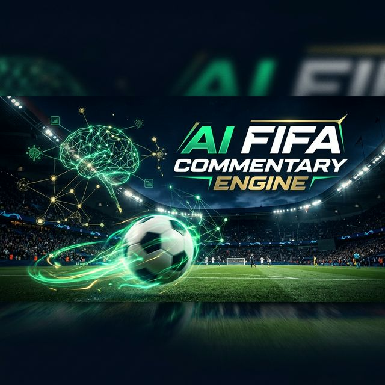
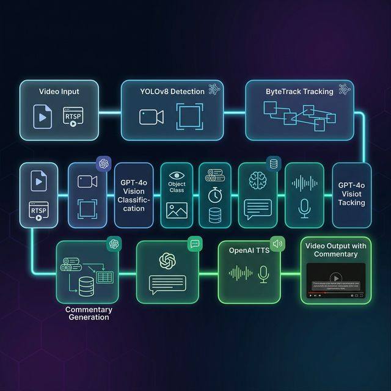

<p align="center">
  
</p>

<h1 align="center">⚽ Automated FIFA Commentary Engine</h1>

<p align="center">
  <strong>AI-powered real-time football match commentary generation using Computer Vision + NLP + TTS</strong>
</p>

<p align="center">
  <a href="#features">Features</a> •
  <a href="#architecture">Architecture</a> •
  <a href="#quick-start">Quick Start</a> •
  <a href="#configuration">Configuration</a> •
  <a href="#project-structure">Project Structure</a> •
  <a href="#how-it-works">How It Works</a> •
  <a href="#contributing">Contributing</a>
</p>

<p align="center">
  
  
  
  
  
</p>

---

## 🎯 Overview

The **Automated FIFA Commentary Engine** is an end-to-end AI pipeline that takes raw football match video footage and produces professional-quality, play-by-play commentary with synchronized audio. It combines state-of-the-art Computer Vision for player/ball detection, GPT-4o Vision for event classification, GPT language models for natural commentary generation, and OpenAI TTS for lifelike speech synthesis.

The system analyzes every frame, identifies key match events (goals, passes, tackles, fouls, etc.), and generates commentary that matches the pacing and intensity of the game — all fully automated.

---

## ✨ Features

| Feature | Description |
|---------|-------------|
| 🎥 **Video Analysis** | Frame-by-frame analysis using YOLOv8 for player and ball detection |
| 🏃 **Multi-Object Tracking** | ByteTrack-based tracking to follow players and the ball across frames |
| 🧠 **AI Event Classification** | GPT-4o-mini Vision identifies match events (goals, passes, tackles, fouls, etc.) |
| 📝 **Natural Commentary** | GPT generates broadcast-quality play-by-play with dynamic pacing |
| 🔊 **Text-to-Speech** | OpenAI TTS converts commentary to realistic speech audio |
| 🎬 **Video Export** | Outputs the original video overlaid with generated commentary audio |
| ⚙️ **Configurable Pipeline** | YAML-based configuration for every stage of the pipeline |
| 🎮 **13 Event Types** | Recognizes possession, pass, shot, goal, tackle, corner kick, free kick, foul, throw-in, goalkeeper saves, goal kick, and celebration |

---

## 🏗️ Architecture

<p align="center">
  
</p>

The system is built as a **modular, multi-stage pipeline** where each component can be independently configured and swapped:

```
┌──────────────┐    ┌───────────────┐    ┌────────────────┐    ┌──────────────────┐
│  Video Input │───▶│ YOLOv8        │───▶│ ByteTrack      │───▶│ GPT-4o-mini      │
│  (MP4/AVI)   │    │ Detection     │    │ Tracking       │    │ Vision Classifier│
└──────────────┘    └───────────────┘    └────────────────┘    └────────┬─────────┘
                                                                        │
                                                                        ▼
┌──────────────┐    ┌───────────────┐    ┌────────────────┐    ┌──────────────────┐
│ Final Video  │◀───│ OpenAI TTS    │◀───│ GPT Commentary │◀───│ Event            │
│ + Commentary │    │ (Speech)      │    │ Generator      │    │ Aggregator       │
└──────────────┘    └───────────────┘    └────────────────┘    └──────────────────┘
```

### Pipeline Stages

1. **Detection** — YOLOv8 identifies players (`person`) and the ball (`sports_ball`) in each frame
2. **Tracking** — ByteTrack assigns persistent IDs to detected objects across frames
3. **Classification** — GPT-4o-mini Vision analyzes frames to classify match events with confidence scores
4. **Aggregation** — Events are batched and filtered using cooldown windows to prevent duplicate commentary
5. **Commentary** — GPT generates natural, broadcast-style commentary with pacing matched to video duration
6. **TTS** — OpenAI Text-to-Speech synthesizes lifelike audio narration
7. **Video Export** — MoviePy overlays the commentary audio onto the original video

---

## 🚀 Quick Start

### Prerequisites

- **Python 3.9+**
- **OpenAI API Key** (for GPT-4o Vision, GPT commentary, and TTS)
- **FFmpeg** (required by MoviePy for video processing)

### 1. Clone the Repository

```bash
git clone https://github.com/bhatticoder/Automated-Fifa-Commentary.git
cd Automated-Fifa-Commentary
```

### 2. Create a Virtual Environment

```bash
python -m venv .venv

# Windows
.venv\Scripts\activate

# macOS/Linux
source .venv/bin/activate
```

### 3. Install Dependencies

```bash
pip install -r requirements.txt
```

### 4. Set Up Environment Variables

```bash
cp .env.example .env
```

Edit `.env` and add your OpenAI API key:

```env
OPENAI_API_KEY=your_openai_api_key_here
```

### 5. Run the System

```bash
python run_standalone.py "path/to/your/match_video.mp4"
```

The system will:
1. Analyze every frame of the video
2. Detect players and the ball
3. Classify match events (goals, passes, tackles, etc.)
4. Generate broadcast-quality commentary
5. Synthesize speech audio
6. Save the final video with commentary to `outputs/`

---

## ⚙️ Configuration

The pipeline is configured via YAML files in the `configs/` directory.

### `configs/pipeline.yaml`

```yaml
pipeline:
  detection:
    model: yolov8n               # YOLOv8 model variant
    confidence_threshold: 0.5     # Min detection confidence

  tracking:
    tracker: bytetrack            # Tracking algorithm
    track_thresh: 0.5             # Tracking threshold
    track_buffer: 30              # Frames to keep lost tracks
    match_thresh: 0.8             # IOU matching threshold

  classification:
    model: gpt-4o-mini            # Vision model for event classification
    window_size: 16               # Frame buffer size
    events:                       # Recognized event types
      - possession
      - pass
      - shot_on_goal
      - goal
      - tackle
      - corner_kick
      - free_kick
      - foul
      - throw_in
      - gk_grab
      - gk_punch
      - goal_kick
      - celebration

  aggregation:
    cooldown_period: 2.0          # Seconds between same event type
    goal_cooldown: 7.0            # Extended cooldown for goals
    min_confidence: 0.4           # Minimum event confidence
    batch_window: 999.0           # Batch window in seconds

  commentary:
    model: gpt-4o-mini            # LLM for commentary generation
    max_tokens: 400               # Max tokens per commentary
    temperature: 0.7              # Creativity level

  tts:
    model: tts-1                  # OpenAI TTS model
    voice: alloy                  # Voice selection
    speed: 1.0                    # Speech speed multiplier
```

### Available TTS Voices

| Voice | Description |
|-------|-------------|
| `alloy` | Neutral, balanced tone |
| `echo` | Deep, warm voice |
| `fable` | Expressive, British accent |
| `onyx` | Deep, authoritative |
| `nova` | Young, energetic |
| `shimmer` | Soft, warm |

---

## 📁 Project Structure

```
Automated-Fifa-Commentary/
├── 📄 run_standalone.py              # Main entry point
├── 📄 requirements.txt               # Python dependencies
├── 📄 .env.example                   # Environment template
├── 📁 assets/                        # README images
│   ├── banner.png
│   └── pipeline.png
├── 📁 configs/
│   ├── models.yaml                   # Model path configuration
│   └── pipeline.yaml                 # Full pipeline configuration
├── 📁 outputs/                       # Generated videos with commentary
└── 📁 services/
    └── worker/
        └── app/
            ├── 📄 config.py              # YAML config loader
            ├── 📄 pipeline.py            # Core pipeline orchestrator
            ├── 📁 detectors/
            │   └── yolo_detector.py      # YOLOv8 object detection
            ├── 📁 trackers/
            │   └── bytetrack_wrapper.py  # Multi-object tracking
            ├── 📁 classifiers/
            │   └── video_classifier.py   # GPT-4o Vision event classifier
            ├── 📁 aggregator/
            │   └── event_aggregator.py   # Event batching & filtering
            ├── 📁 nlp/
            │   └── commentary_generator.py  # GPT commentary engine
            ├── 📁 tts/
            │   └── piper_tts.py          # OpenAI TTS synthesis
            └── 📁 utils/
                ├── video_reader.py       # OpenCV video frame reader
                └── video_editor.py       # MoviePy video + audio merger
```

---

## 🔬 How It Works

### 1. Object Detection (YOLOv8)
The detector processes every 90th frame for efficiency, identifying `person` and `sports_ball` objects. Each detection includes bounding box coordinates, confidence scores, and class labels.

### 2. Multi-Object Tracking (ByteTrack)
A simplified ByteTrack implementation uses **IOU-based matching** to assign persistent track IDs to detected objects across frames. Tracks are aged out after a configurable buffer window to handle occlusions.

### 3. Event Classification (GPT-4o Vision)
Each processed frame is encoded to base64 and sent to GPT-4o-mini's vision endpoint. The model analyzes the football scene and returns a JSON classification:

```json
{
  "event": "shot_on_goal",
  "confidence": 0.85,
  "description": "Player winds up and strikes the ball towards the far post"
}
```

### 4. Event Aggregation
Raw events are filtered through:
- **Confidence thresholding** — Events below `min_confidence` are discarded
- **Cooldown windows** — Prevents spamming the same event type (goals get extended 7s cooldown)
- **Batch windowing** — Events are grouped into time-based batches for context-aware commentary

### 5. Commentary Generation (GPT)
The aggregated events are sent to GPT with a specialized **sports broadcaster prompt** that:
- Paces narration to match video timestamps
- Fills time gaps with scene-setting and tension building
- Treats goals as climactic moments with maximum energy
- Targets a specific word count based on clip duration (~2.2 words/second)

### 6. Text-to-Speech (OpenAI)
The generated commentary text is synthesized using OpenAI's TTS-1 model with configurable voice and speed settings.

### 7. Video Export (MoviePy)
The final step uses MoviePy to composite the original video with the generated TTS audio, producing a broadcast-ready video file.

---

## 🛠️ Tech Stack

| Technology | Purpose |
|-----------|---------|
| **Python 3.9+** | Core language |
| **YOLOv8 (Ultralytics)** | Real-time object detection |
| **OpenCV** | Video frame reading and processing |
| **GPT-4o-mini** | Vision-based event classification |
| **GPT-4o-mini / GPT-3.5-turbo** | Natural commentary generation |
| **OpenAI TTS** | Text-to-speech synthesis |
| **MoviePy** | Video editing & audio overlay |
| **PyTorch** | Deep learning framework |
| **NumPy** | Numerical computation |
| **PyGame** | Real-time audio playback |
| **PyYAML** | Configuration management |

---

## 🤝 Contributing

Contributions are welcome! Here's how you can help:

1. **Fork** the repository
2. **Create** a feature branch (`git checkout -b feature/amazing-feature`)
3. **Commit** your changes (`git commit -m 'Add amazing feature'`)
4. **Push** to the branch (`git push origin feature/amazing-feature`)
5. **Open** a Pull Request

### Ideas for Contribution

- 🏟️ Add support for player name recognition via jersey number OCR
- 📊 Build a web dashboard for real-time commentary visualization
- 🌍 Add multi-language commentary support
- 🎤 Add multiple commentator voice personalities
- 📈 Implement match statistics tracking (possession %, shots, etc.)
- 🔄 Support live video stream input (RTSP/HLS)

---

## 📋 Requirements

| Package | Version | Purpose |
|---------|---------|---------|
| `torch` | Latest | Deep learning framework |
| `torchvision` | Latest | CV model utilities |
| `ultralytics` | Latest | YOLOv8 detection |
| `opencv-python` | Latest | Video processing |
| `numpy` | Latest | Array operations |
| `pyyaml` | Latest | Config parsing |
| `python-dotenv` | Latest | Environment variables |
| `openai` | Latest | GPT + TTS API |
| `moviepy` | Latest | Video editing |
| `pygame` | Latest | Audio playback |

---

## 📜 License

This project is licensed under the **MIT License** — see the [LICENSE](LICENSE) file for details.

---

## 🙏 Acknowledgments

- [Ultralytics YOLOv8](https://github.com/ultralytics/ultralytics) — State-of-the-art object detection
- [OpenAI](https://openai.com) — GPT Vision, Language Models, and TTS
- [ByteTrack](https://github.com/ifzhang/ByteTrack) — Multi-object tracking algorithm
- [MoviePy](https://zulko.github.io/moviepy/) — Video editing in Python

---

<p align="center">
  Made with ❤️ by <a href="https://github.com/bhatticoder">bhatticoder</a>
</p>